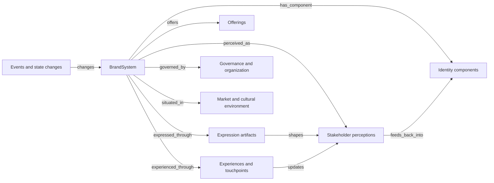
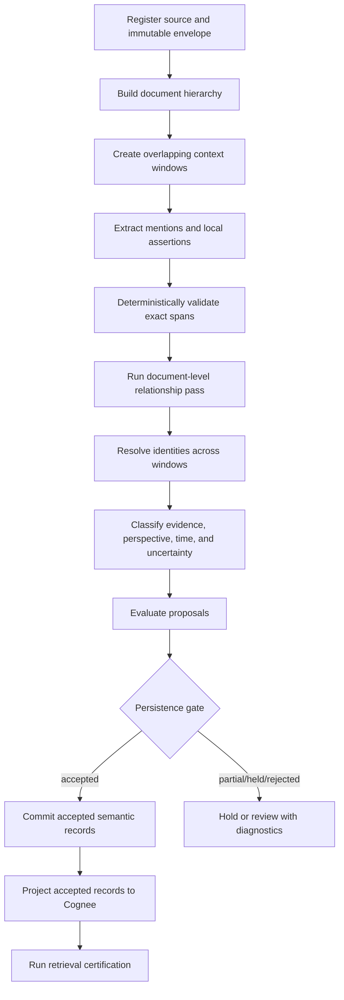

# Brand system modular infrastructure implementation plan

Status: proposed implementation plan  
Date: 2026-08-18  
Scope: provider-neutral Brand domain, evidence-preserving extraction, Cognee projection,
LangGraph orchestration, and optional DeepSeek Harness inference

> This implementation plan is refined by the
> [Brand Ontology Constitution v0.1](2026-08-20-brand-ontology-constitution-v0.1-design.md).
> Where the documents differ, the constitution controls ontology research and future schema work.
> The existing Brand ontology 1.0.0 remains a prototype and migration source.

## 1. Outcome

Build a modular Brand intelligence substrate in which a brand is represented as a dynamic
system of typed components, relationships, evidence, perceptions, events, and derived states.
The semantic definition must remain owned by Testflight. Cognee will provide dataset-scoped
graph/vector retrieval, but it will not become the canonical ontology or the only persistence
implementation.

The first complete vertical slice must be able to:

1. create an isolated Brand workspace from a tracked template;
2. load a versioned Brand ontology from Git;
3. ingest an intended-brand source and an observed-perception source;
4. extract exact evidence spans using surrounding document context;
5. preserve mentions, occurrences, identity hypotheses, and assertions separately;
6. validate and persist accepted proposals in an owned semantic repository;
7. project the accepted graph into one workspace-scoped Cognee dataset;
8. retrieve evidence for intended identity, observed perception, and their divergence; and
9. rebuild the Cognee dataset deterministically from canonical records.

The baseline design represents intended and observed Brand layers separately. This is an
assumption for the implementation plan and can be narrowed without changing the infrastructure.

## 2. Architectural decision

### Considered approaches

#### A. Cognee-first custom graph model

Define Brand Pydantic models directly in the Cognee adapter and let `cognify()` extract and
persist them. This is the fastest proof of concept, but it makes Cognee's storage model the
effective ontology, makes provider replacement difficult, and weakens replay and migration.

#### B. Provider-neutral semantic core with Cognee projection — selected

Own semantic records, definitions, validation, identity, evidence, and versioning in Testflight.
Use thin adapters for inference, orchestration, canonical persistence, and Cognee projection.
This preserves the current integration-laboratory policy and gives us a clear path from a local
prototype to a durable service.

#### C. Full event-sourced graph platform

Make every change an event, run a dedicated graph service, and treat Cognee as one of several
read models. This is the strongest long-term architecture, but it adds operational machinery
before a real Brand workflow has established the required scale.

Approach B should use append-only records and deterministic projections so it can evolve toward
approach C without a rewrite.

## 3. Vocabulary and boundaries

Use these terms consistently:

| Term | Meaning |
| --- | --- |
| Brand workspace | Testflight's isolation boundary for configuration, evidence, semantic records, indexes, and permissions. |
| Cognee dataset | The Cognee-native storage and processing boundary used for one workspace projection. |
| Definition | A versioned semantic contract describing a type or relationship. |
| Mention | An exact source span that may denote a referent. |
| Occurrence | A validated mention in one source/time/context. |
| Canonical entity | A scoped identity that may be supported by several occurrences. |
| Assertion | A source-grounded proposition linking a subject and object through a defined predicate. |
| State snapshot | A derived, versioned view of a Brand system at a time and branch. |
| Projection | Rebuildable provider-specific data derived from canonical records. |

The system has five explicit planes:

1. **Definition plane:** versioned ontology and policies tracked in Git.
2. **Evidence plane:** immutable source envelopes and exact evidence spans.
3. **Semantic proposal plane:** extracted mentions, assertions, hypotheses, and evaluations.
4. **Canonical state plane:** accepted identities, assertions, versions, and derived snapshots.
5. **Runtime projection plane:** Cognee graph/vector indexes, caches, and query materializations.

No record may cross a plane without a typed handoff and derivation receipt. Cognee data is a
projection and must be safe to discard and rebuild; evidence and accepted semantic records are
not.

## 4. System-theoretic Brand model

`BrandSystem` is a stable identity and boundary handle, not a bag containing all Brand truth.
Its meaning emerges from components, relations, feedback, environment, and change over time.



Start with configurable component categories rather than a deep Python subclass hierarchy:

- identity: purpose, values, promise, personality, positioning;
- expression: name, language, visual identity, symbols, narratives;
- offering: products, services, capabilities, price/value propositions;
- experience: touchpoints, interactions, service outcomes;
- perception: associations, expectations, sentiment, trust, reputation;
- governance: owner, organization, policy, employees, partners;
- environment: audiences, competitors, categories, culture, regulation; and
- event: launches, incidents, campaigns, changes, and external shocks.

These are initial definition records, not permanently hard-coded universal categories.

### Intended and observed layers

Every material assertion carries a `perspective`:

- `intended`: owner-approved normative identity or strategy;
- `expressed`: what artifacts and communications present;
- `experienced`: what occurred at a touchpoint;
- `reported`: what a source says happened or is believed;
- `observed`: directly measured evidence;
- `inferred`: a bounded interpretation derived from other assertions; or
- `hypothesized`: a proposal awaiting stronger support.

An intended value and an observed perception may point to the same component definition, but
they remain separate assertions. Divergence is represented explicitly instead of choosing one
as the Brand's single truth.

## 5. Weighted relationship design

Use a typed property graph with evidence-bearing assertion nodes. Do not reduce a relationship
to one overloaded weight.

```text
CanonicalEntity --subject_of--> Assertion --object--> CanonicalEntity
                                  |
                                  +-- instantiates --> RelationshipDefinition
                                  +-- supported_by --> EvidenceSpan
                                  +-- contradicted_by --> EvidenceSpan/Assertion
                                  +-- evaluated_by --> EvaluationRecord
```

`Assertion` should contain these independent dimensions:

| Field | Meaning |
| --- | --- |
| `structural_weight` | Proposed importance/contribution of the relation within the Brand system. |
| `evidence_confidence` | Uncertainty estimate about this scoped assertion; never a truth flag. |
| `source_authority` | Policy-derived authority of the source for this kind of claim. |
| `salience` | Observed prominence within a declared corpus, population, and time window. |
| `valence` | Signed evaluative direction where the relationship type permits it. |
| `valid_time` | When the assertion is claimed to hold. |
| `recorded_time` | When Testflight learned or stored it. |
| `epistemic_status` | Normative, reported, observed, inferred, hypothesized, retracted, or unresolved. |

Cognee direct edges may carry a derived traversal weight and `assertion_id`, but the assertion
node remains the audit record. Any `effective_strength` must include a versioned `weight_policy_id`
and its inputs. Version 1 should store the dimensions without producing an overall Brand score.
An aggregate score is allowed only after calibration fixtures and a documented use case exist.

Composition, temporal order, correlation, influence, and causality must use different
relationship definitions. A causal edge requires mechanism or direct causal evidence; sequence
or semantic similarity is insufficient.

## 6. Target module layout

```text
domains/
  brand/
    ontology/
      brand-system.yaml
      entity-types/
      relationship-types/
      perspectives.yaml
    policies/
      identity-resolution-v1.yaml
      assertion-acceptance-v1.yaml
      relationship-weight-v1.yaml
    fixtures/
      minimal-brand/

packages/
  testflight-semantic/
    src/testflight_semantic/
      definitions.py
      evidence.py
      mentions.py
      assertions.py
      identity.py
      versions.py
      evaluations.py
      ports.py
      ids.py
    tests/
  testflight-brand/
    src/testflight_brand/
      models.py
      ontology.py
      policies.py
      queries.py
      metrics.py
    tests/

adapters/
  cognee/
    src/testflight_adapter_cognee/
      extraction_provider.py
      brand_projection.py
      brand_search.py
  langgraph/
    src/testflight_adapter_langgraph/
      brand_workflow.py
  deepseek-harness/
    src/
      structured-generation.ts
  sqlite-semantic/
    src/testflight_adapter_sqlite_semantic/
      repository.py
      migrations/

apps/
  brand-lab/
    src/testflight_brand_lab/
      cli.py
      commands/
      composition.py

workspaces/
  brand-template/
    WORKSPACE.yaml
    AGENT_INDEX.md
    AGENT_CONFIG.yaml
    resource_registry.json
    certification_cases/

experiments/
  brand-first-vertical-slice/

infra/
  brand.compose.yaml
```

The final names may be shortened, but the dependency direction must remain:

```text
testflight-semantic <- testflight-brand <- brand-lab
          ^                    ^              |
          |                    |              v
     storage adapter      provider adapters and runtime composition
```

`testflight-semantic` must not import Cognee, LangGraph, DeepSeek Harness, a database client, or
Brand-specific types. `testflight-brand` may depend only on the semantic package and Pydantic.
Upstream imports remain inside their adapters. The application composition root is the only
place that chooses implementations.

## 7. Provider-neutral contracts

### Definition records

Add versioned `EntityTypeDefinition`, `RelationshipTypeDefinition`, and `ComponentTypeDefinition`
records. Each requires:

- stable definition URI and semantic version;
- label and full definition;
- inclusion, exclusion, boundary, and inference rules;
- allowed subject/object types and cardinality;
- allowed perspectives and epistemic statuses;
- temporal behavior;
- examples and counterexamples;
- deprecation/replacement metadata; and
- definition source and authority.

Definitions are loaded from `domains/brand/` and validated before any provider call.

### Evidence and extraction records

Introduce:

- `EvidenceEnvelope`: source ID, workspace ID, content hash, source URI, actor/author,
  source time, recorded time, media type, access classification, and immutable content reference;
- `EvidenceSpan`: envelope ID, exact quote, byte/character offsets, section/window identity;
- `Mention`: source span plus candidate semantic type;
- `ReferentHypothesis`: mention-to-entity proposal with discriminating evidence;
- `EntityOccurrence`: validated local occurrence;
- `AssertionProposal`: subject/object hypotheses, relationship definition, perspective, evidence,
  status, time, and score dimensions;
- `DerivationRecord`: operator/model/config/input identities and parent derivations; and
- `EvaluationRecord`: separate schema, invariant, semantic, and usefulness results.

Keep the current exact-span validation and UUIDv5 identity behavior. Extend the identity input to
include workspace, definition version, source hash, span, and branch so semantically meaningful
changes invalidate old IDs while execution retries remain idempotent.

### Ports

Define protocols for:

- `DefinitionRegistry`;
- `EvidenceRepository`;
- `StructuredExtractionProvider`;
- `ExtractionValidator`;
- `IdentityResolver`;
- `AssertionRepository`;
- `ProjectionAdapter`;
- `SearchAdapter`;
- `SemanticEvaluator`; and
- `RunReceiptRepository`.

Ports return typed `accepted`, `partial`, `held`, `rejected`, `unavailable`, and `no_hit` outcomes.
They do not use exceptions for expected semantic uncertainty.

## 8. Persistence strategy

### Canonical local implementation

Implement an append-oriented SQLite adapter first. Store it outside Git at:

```text
/home/talha/testflight/.data/brand-workspaces/<workspace-slug>/semantic.sqlite3
```

The schema should contain independent tables for workspaces, definition versions, evidence
envelopes, evidence spans, occurrences, identity hypotheses, canonical entities, assertions,
assertion support/contradiction links, derivations, evaluations, projection receipts, and run
attempts.

Use migrations from the first version. Never update evidence content in place. Corrections create
new versions and invalidate dependent projections. SQLite is an adapter decision; a future
Postgres implementation must satisfy the same repository contract.

### Cognee projection

Use one Cognee dataset per Brand workspace and projection version:

```text
testflight_brand_<workspace-slug>_p<projection-version>
```

Project accepted definitions, canonical entities, assertion nodes, source references, and direct
traversal edges. Do not project rejected or held proposals as accepted facts. They may be placed
in a separately named review dataset only if a real review workflow requires it.

Every projection run records:

- workspace and dataset IDs;
- source repository revision;
- ontology and policy versions;
- projection adapter version;
- included canonical record IDs and hashes;
- effective non-secret provider configuration;
- start/end time and outcome; and
- certification result.

Build a new dataset version side by side, certify it, then change the workspace's active
projection reference. Do not mutate a production dataset destructively during ontology changes.

## 9. Context-preserving extraction pipeline

Do not perform semantic extraction independently per arbitrary chunk. Chunks are evidence and
retrieval units, not autonomous meaning boundaries.

Use this sequence:



The document hierarchy should retain document, section, paragraph, sentence, and window IDs.
Each model call receives a bounded target window plus enough preceding/following and document-level
context to resolve meaning. The model still returns exact quotes from the source. Cross-window
relationships are emitted only during a second pass that can see both endpoints and their
supporting context.

The first extractor implementation may use Cognee's structured-output gateway. The interface
must also support a DeepSeek Harness-backed provider later. Provider output always passes through
the same deterministic validator and semantic evaluator.

## 10. LangGraph orchestration

Implement the pipeline as a graph only after the provider-neutral functions pass unit tests.
The LangGraph adapter owns LangGraph imports and maps stable workflow state to/from its runtime.

Required nodes:

1. `preflight_configuration`;
2. `register_evidence`;
3. `compile_document_context`;
4. `select_definitions`;
5. `extract_local_candidates`;
6. `validate_source_grounding`;
7. `extract_cross_context_relationships`;
8. `resolve_identity_hypotheses`;
9. `evaluate_assertion_proposals`;
10. `gate_persistence`;
11. `commit_semantic_records`;
12. `project_cognee_dataset`;
13. `certify_retrieval`; and
14. `emit_run_receipt`.

Workflow state carries only IDs, bounded context packets, decisions, and receipts. Large source
content remains in the evidence repository. Checkpoints must be workspace-scoped. Retries use a
semantic idempotency key derived from workspace, operator/definition versions, configuration,
source hashes, and requested output schema. A provider attempt ID is never used as semantic
identity.

Branches must explicitly support `hold`, `partial`, `rejected`, `unavailable`, and `no_hit`.
Only the persistence gate may produce committed semantic state.

## 11. DeepSeek Harness integration

Treat DeepSeek Harness as an optional structured-generation/agent runtime, not as a direct Cognee
dependency. Extend the existing TypeScript adapter with a JSON-compatible request/response
contract containing:

- request ID and semantic idempotency key;
- workspace and definition versions;
- bounded context and response JSON Schema;
- provider/model/budget policy references;
- structured result or typed failure;
- token/latency receipt without secret material; and
- model/configuration fingerprint.

Expose it first through a local subprocess JSONL boundary or a small localhost-only service.
`StructuredExtractionProvider` selects either the Cognee gateway or Harness adapter through
configuration. The Brand domain must not know which provider generated the proposal.

Do not enable autonomous mutation or external actions in the Brand workflow. Agentic work may
research, compare, extract, and propose; semantic persistence still passes deterministic and
semantic gates.

## 12. Retrieval design

Route queries by intent before calling Cognee:

| Intent | Scope/filter | Retrieval mode |
| --- | --- | --- |
| Find a definition | Definition records | Exact/BM25 first |
| Find source evidence | Evidence spans and assertions | BM25, then bounded hybrid |
| Explore Brand composition | Canonical entities and `has_component` paths | Graph, maximum two hops |
| Compare intended and observed Brand | Matching component definitions across perspectives | Filtered graph plus evidence retrieval |
| Find similar language | Evidence spans/artifacts | Vector/hybrid |
| Explain a relationship | Assertion node, support, contradiction, source | Graph path plus exact evidence |

The query compiler must require workspace, active projection, perspective, time, and access scope.
Retrieval returns ranked evidence and graph records, not a truth conclusion. Interpretation is a
separate, source-citing step. Out-of-domain requests return `NO_HITS`; broad semantic fallback is
not allowed to manufacture relevance.

Index only fields that support declared queries. Suggested initial fields are definition labels,
entity canonical labels, artifact titles, assertion predicates, and exact evidence text. Do not
embed secrets, private source metadata, opaque IDs, or every numeric score.

## 13. Workspace template

Create `workspaces/brand-template/` with:

- `WORKSPACE.yaml`: workspace URI, Brand ID, ontology version, active projection, source scope,
  permissions, data classification, retention, and runtime paths;
- `AGENT_INDEX.md`: intent-to-artifact and intent-to-query routing;
- `AGENT_CONFIG.yaml`: extraction, evidence, identity, scoring, retrieval, and mutation policies;
- `resource_registry.json`: canonical ontology/policy/source metadata;
- `task_views/`: define, ingest, extract, review, query, rebuild, and certify;
- `certification_cases/`: exact, semantic, adversarial, path, temporal, contradiction, and no-hit
  probes; and
- `README.md`: local and server operating instructions.

The template does not contain a real brand or evidence. `brand-workspace init <slug>` creates a
workspace manifest and ignored runtime directories. It never copies credentials or databases.

## 14. Implementation sequence

Each phase should land as a reviewable commit and leave `make check` passing.

### Phase 0 — Record decisions and freeze vocabulary

1. Add an ADR selecting provider-neutral canonical records with Cognee as a projection.
2. Add `domains/brand/README.md` with the vocabulary in section 3.
3. Record that intended and observed layers remain separate.
4. Define URI conventions for workspace, definition, entity, assertion, source, run, and
   projection identities.
5. Add architecture checks forbidding Cognee/LangGraph imports outside their adapters.

Acceptance gate: every important object has one semantic meaning and one named owner.

### Phase 1 — Extract the semantic core from the Cognee adapter

1. Add `packages/testflight-semantic` to the uv workspace.
2. Move provider-neutral definitions, extraction models, prompt compilation, and validation from
   `adapters/cognee` into the new package.
3. Preserve current public imports temporarily through adapter re-exports.
4. Add workspace, evidence hash, definition version, perspective, time, and epistemic status to
   the records.
5. Add protocol definitions and typed outcomes.
6. Update existing tests before removing compatibility exports.

Acceptance gates:

- semantic tests run without Cognee installed;
- exact-span grounding remains 100 percent;
- stable IDs change when a meaning-affecting input changes; and
- no upstream-specific import exists in the semantic package.

### Phase 2 — Implement the Brand domain

1. Add `packages/testflight-brand` and the canonical `domains/brand` definitions.
2. Implement ontology loading and deterministic validation.
3. Add `BrandSystem`, `BrandComponent`, `BrandArtifact`, `Touchpoint`, `StakeholderPerspective`,
   `BrandEvent`, `Assertion`, and `BrandStateSnapshot` records.
4. Implement allowed subject/object checks for relationship definitions.
5. Implement intended/expressed/experienced/reported/observed/inferred/hypothesized perspectives.
6. Add minimal fixtures containing one intended assertion, one observed assertion, one supported
   divergence, and one contradiction.

Acceptance gate: the minimal fixture can be represented without generic untyped entities or an
overall Brand score.

### Phase 3 — Add canonical repositories

1. Add the SQLite semantic adapter and migration framework.
2. Implement append-only evidence, occurrence, assertion, derivation, and evaluation writes.
3. Implement optimistic revision checks for canonical entities and snapshots.
4. Add transactions so an accepted semantic batch commits atomically.
5. Implement deterministic replay queries and projection cursors.
6. Add backup/restore documentation for `.data/brand-workspaces/`.

Acceptance gates:

- retrying the same semantic request creates one accepted record;
- interrupted attempts do not appear as accepted results;
- a correction preserves history and marks dependent projections stale; and
- repository tests run against a temporary database.

### Phase 4 — Build the workspace template and CLI

1. Add the tracked Brand workspace template and validators.
2. Add standard-library CLI commands: `init`, `validate`, `ingest`, `extract`, `review`, `project`,
   `query`, `rebuild`, and `certify`.
3. Implement `--dry-run` and redacted effective-configuration output before provider calls.
4. Generate stable ignored runtime paths and dataset names from the workspace manifest.
5. Add exact/no-hit/adversarial certification probes.

Acceptance gate: a new workspace can be created and validated without Cognee, LangGraph, a model,
or a network connection.

### Phase 5 — Upgrade extraction to document continuity

1. Implement document hierarchy and overlapping context windows.
2. Refactor the existing extractor to accept an `ExtractionRequest` containing target and context
   boundaries rather than a naked chunk string.
3. Preserve exact spans against the immutable full source.
4. Add a second document-level relationship pass.
5. Add identity hypotheses without automatic canonical merging.
6. Add independent semantic evaluation fixtures.

Acceptance gates:

- relationships requiring adjacent sections are extracted in continuity fixtures;
- isolated chunks cannot silently create document-level assertions;
- pronoun/alias ambiguity remains unresolved when evidence is insufficient; and
- no model output persists before evaluation.

### Phase 6 — Implement the Cognee projection adapter

1. Add Brand-specific DataPoint factories inside the Cognee adapter.
2. Map definitions, canonical entities, assertion nodes, evidence references, and direct edges.
3. Use deterministic DataPoint IDs and include workspace/projection metadata.
4. Add `assertion_id`, relationship type, and an optional policy-derived traversal weight to
   direct edges.
5. Implement dataset build, verification, and side-by-side cutover receipts.
6. Add an opt-in live integration test against an isolated temporary dataset.

Acceptance gates:

- all projected records resolve to canonical repository records;
- held/rejected proposals are absent from the accepted dataset;
- two identical builds produce the same semantic graph identities;
- a failed build does not change the active projection; and
- the dataset can be rebuilt after its generated files are removed in a disposable test.

### Phase 7 — Add LangGraph orchestration

1. Wrap already-tested functions as workflow nodes.
2. Implement typed workflow state with IDs and bounded context only.
3. Add checkpoint namespace and cache keys containing workspace and configuration fingerprints.
4. Implement explicit branch routing for hold/partial/rejected/unavailable states.
5. Add bounded retries and circuit behavior around provider calls.
6. Emit a complete run receipt from evidence through projection/certification.

Acceptance gates:

- replay after an interrupted provider call does not duplicate semantic records;
- workspaces cannot share checkpoints or cache entries;
- a held evaluation never reaches commit/project nodes; and
- the non-LangGraph functions remain independently callable.

### Phase 8 — Add DeepSeek Harness as a second provider

1. Define the cross-runtime JSON Schema in a provider-neutral location.
2. Implement request/response validation in Python and TypeScript.
3. Add the local subprocess or localhost service bridge.
4. Map Harness failures to typed semantic outcomes and receipts.
5. Run the same golden extraction suite against both providers.

Acceptance gate: switching provider configuration does not change domain or persistence code, and
provider differences are visible in evaluation records rather than normalized away.

### Phase 9 — Implement retrieval and comparison views

1. Add query intents and filters in `testflight-brand`.
2. Implement Cognee search mapping inside the Cognee adapter.
3. Add intended-only, observed-only, and divergence comparison views.
4. Resolve every response statement to assertion and evidence IDs.
5. Add BM25-first, bounded hybrid, two-hop graph, and no-hit policies.
6. Add a machine-readable result contract for future API/UI consumers.

Acceptance gates:

- definition queries return definitions, not navigation files;
- relationship explanations include exact source evidence;
- intended and observed assertions are not merged;
- top-1 probe precision is at least 0.90;
- routing error is at most 0.03; and
- out-of-domain `NO_HITS` correctness is 1.0.

### Phase 10 — Server operation and production preparation

1. Add `infra/brand.compose.yaml` only for processes that now exist; keep persistent volumes and
   databases outside the application image.
2. Add server setup, migration, backup, restore, project, certify, and health commands.
3. Run one writer per local Cognee/Ladybug dataset and serialize project/rebuild operations.
4. Add redacted structured logging and run/projection metrics.
5. Add a side-by-side projection upgrade procedure.
6. Run end-to-end certification on the home server before evaluating cloud deployment.

Acceptance gate: a clean server checkout plus secrets and canonical backup can recreate the
active Brand workspace and pass certification without copying generated Cognee files from this
Mac.

## 15. Test strategy

### Deterministic unit tests

- ontology and policy validation;
- URI and UUID derivation;
- exact-span and offset validation;
- subject/object/cardinality checks;
- perspective, time, and status separation;
- weight dimension bounds without aggregate truth conversion;
- optimistic revisions and append-only corrections;
- repository transactions and idempotency; and
- configuration precedence and secret redaction.

### Generative semantic tests

Maintain held-out fixtures for:

- explicit and strongly implied components;
- intended versus observed assertions;
- ambiguous aliases and pronouns;
- relationships spanning adjacent sections;
- narrative sequence without causality;
- contradictory sources;
- high-confidence unsupported output;
- source authority mismatches; and
- out-of-domain/no-hit inputs.

Evaluate schema validity, invariant compliance, semantic fidelity, usefulness, and unresolved
risk separately. The producing model does not grade itself.

### Contract and integration tests

- semantic ports against fake in-memory implementations;
- SQLite repository contract suite;
- Cognee adapter without live inference;
- isolated Cognee live projection/search smoke test;
- LangGraph interruption/replay and branch tests;
- DeepSeek Harness JSON boundary tests; and
- complete vertical slice using the minimal Brand fixture.

### Certification report

Every release report records the query, intended route, actual route, top hit, evidence links,
pass/fail reason, operator/definition/config versions, and remediation. A schema pass cannot erase
a semantic or provenance failure.

## 16. Configuration and secret handling

Declare non-secret configuration in workspace manifests and environment templates. Keep secret
values only in ignored server configuration or a future secret manager. Effective runtime
configuration should expose provider, model, endpoint, ontology version, workspace, budgets,
storage roots, and credential reference names without values.

Configuration precedence should be:

1. safe code defaults;
2. tracked workspace manifest;
3. ignored server environment;
4. explicit CLI override.

Meaning-affecting configuration participates in semantic cache and derivation identity. Failed
preflight means zero provider calls and zero persistent mutation.

## 17. Operations and failure behavior

- Serialize writers for local Cognee datasets to avoid Ladybug file-lock contention.
- Record provider attempts separately from semantic results.
- Use bounded retry with backoff for transient provider failures.
- Never retry a non-idempotent commit without its semantic idempotency key.
- Preserve rejected/held diagnostics in the canonical repository but outside accepted projections.
- Mark projections stale when evidence, definitions, identity links, or policies change.
- Build and certify a replacement dataset before switching the active projection.
- Back up evidence and canonical semantic repositories; rebuild Cognee indexes instead of treating
  them as backup artifacts.
- Report `partial`, `hold`, `unavailable`, and `no_hit` as normal typed outcomes.

## 18. Initial definition of done

The infrastructure is ready for its first real Brand when all of the following are true:

- provider-neutral semantic and Brand packages exist and pass without optional upstreams;
- the existing Cognee semantic code has been moved or wrapped behind those contracts;
- one workspace template and one minimal synthetic fixture are certified;
- evidence, occurrences, identities, assertions, derivations, and evaluations persist separately;
- a multi-section source preserves relationship continuity;
- intended and observed assertions can coexist and be compared;
- Cognee projection and retrieval return exact evidence references;
- rebuilding produces an equivalent certified projection;
- retries do not duplicate committed semantics;
- server backup/restore and projection cutover are documented and tested;
- `make check` remains green; and
- secrets, databases, generated indexes, and source evidence remain outside Git.

## 19. Explicit non-goals for version 1

- a universal or academically complete theory of Brand;
- an overall Brand quality/equity score;
- autonomous changes to Brand strategy or external systems;
- a production web UI;
- multi-region infrastructure;
- automatic irreversible entity merging;
- unbounded graph reasoning;
- replacing Cognee, LangGraph, or DeepSeek Harness internals; or
- selecting a cloud host before the home-server workload is measured.

## 20. Reasoning-operator record

This plan applied the following portable contracts at version 1:

| Operator | Design result | Evaluator result |
| --- | --- | --- |
| `world://operator/guardrail/boundary-conflation` | Definition, evidence, semantic, canonical, and projection planes are explicit. | Plane coverage and handoff completeness: pass for design; runtime proof pending. |
| `world://operator/guardrail/ontology-conflation` | Definitions, mentions, occurrences, entities, assertions, events, states, and provider records remain distinct. | Typed consistency and adapter thinness: pass for proposed mappings. |
| `world://operator/guardrail/mention-entity-conflation` | Mentions link to identity hypotheses before canonical entities. | Span grounding is required at 100%; live ambiguity fixtures pending. |
| `world://operator/guardrail/occurrence-canonical-conflation` | Occurrences survive consolidation and canonical links remain reversible. | Recurrence and lineage gates are specified; implementation pending. |
| `world://operator/guardrail/evidence-truth-conflation` | Assertions carry evidence, scope, perspective, time, status, and contradiction. | Provenance/status/contradiction requirements: pass for schema design. |
| `world://operator/guardrail/confidence-truth-conflation` | Confidence is separated from authority, salience, weight, status, and truth. | Dimension separation: pass; calibration intentionally pending. |
| `world://operator/guardrail/sequence-causality-conflation` | Temporal, correlational, influence, and causal relations use separate definitions. | Causal mechanism gate: specified; fixture proof pending. |
| `world://operator/guardrail/version-state-conflation` | Definitions, accepted records, snapshots, and projections are versioned independently. | Lineage replay/concurrency: specified; end-to-end proof pending. |
| `world://operator/guardrail/identity-provenance-conflation` | Semantic, source, actor, workspace, run, and projection identities are separate. | Identity scope/lineage completeness: pass for contract; runtime proof pending. |
| `world://operator/guardrail/validation-persistence-conflation` | Schema, invariant, semantic evaluation, acceptance, commit, and projection are separate gates. | Persistence gate: structurally present; behavioral proof pending. |
| `world://operator/guardrail/retry-idempotency` | Semantic identity and provider attempts are separate. | Duplicate-safety/cache/circuit tests are required before release. |
| `world://operator/guardrail/workspace-isolation` | Repositories, datasets, caches, checkpoints, and credentials bind to a workspace. | Boundary and permission tests are required before multi-workspace use. |
| `world://operator/guardrail/configuration-runtime` | Effective redacted preflight precedes provider calls and mutation. | Config/secret/preflight gates are part of every live test. |
| `world://operator/guardrail/evaluation-schema` | Structural, invariant, semantic, usefulness, and risk results stay separate. | Dimension separation: pass for test architecture; held-out proof pending. |

The operator results above evaluate this design artifact, not the future implementation. Each
runtime stage must record and re-evaluate the applicable operator versions.

## 21. Capability assumptions to verify against pinned upstreams

The plan uses Cognee 1.5.0's custom `DataPoint`/graph-model boundary, optional relationship
weights, dataset-scoped cognification, and graph/vector/relational storage. Verify these through
adapter contract tests against the pinned release rather than relying on documentation alone:

- [Cognee custom graph models](https://docs.cognee.ai/guides/custom-graph-model)
- [Cognee custom data models and weighted edges](https://docs.cognee.ai/guides/custom-data-models)
- [Cognee storage architecture](https://docs.cognee.ai/core-concepts/architecture)
- [Cognee cognify API](https://docs.cognee.ai/python-api/cognify)
